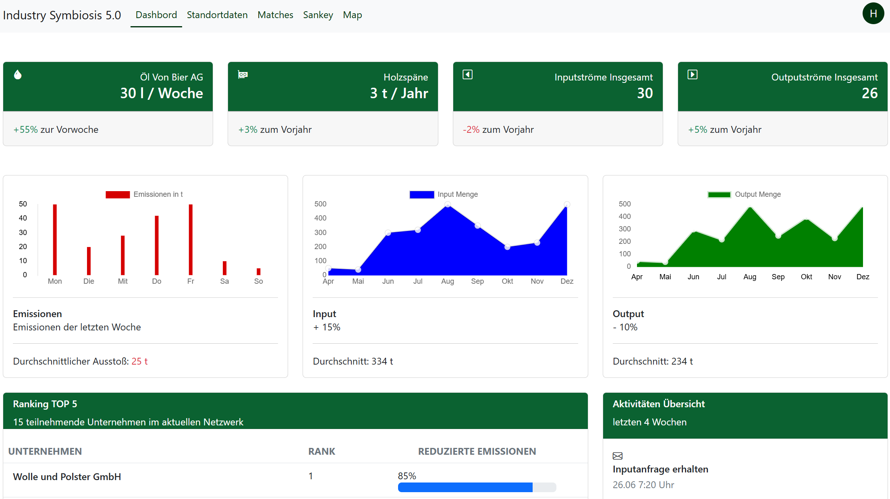
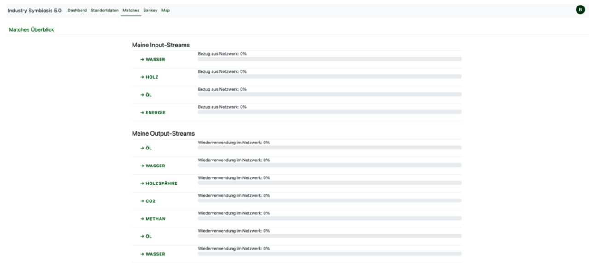
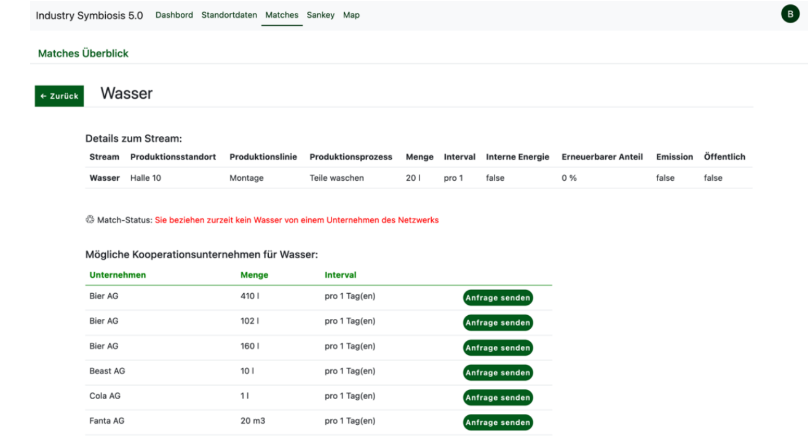
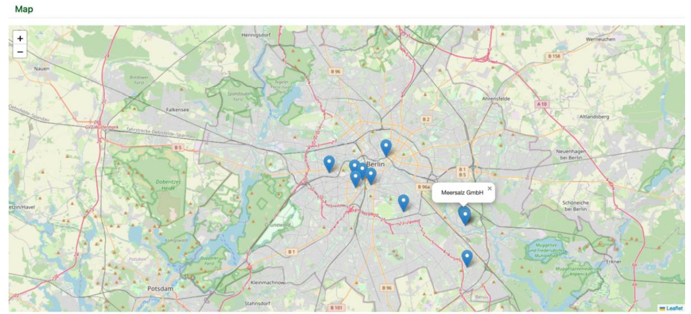
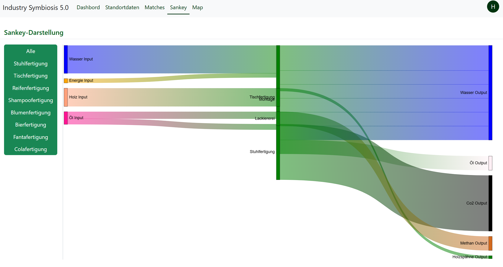
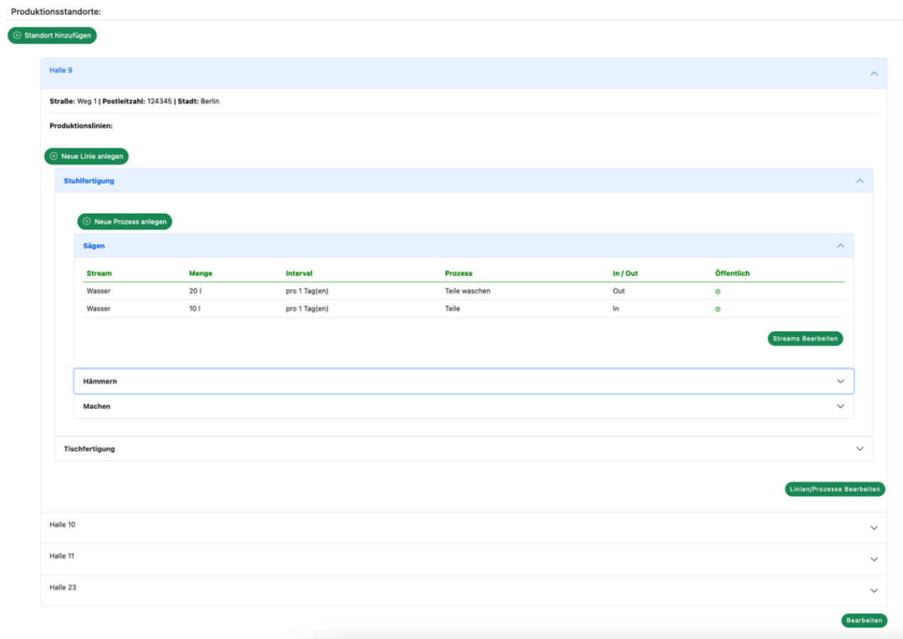

# Industry-Symbiosis: Frontend Interface

⚠️ **Work in Progress:** *This frontend application is currently under active development and is not yet ready for production use.*

This repository contains the frontend user interface for the **Industry-Symbiosis** platform, a prototype designed to help reduce resource waste by matching material and energy flows between industrial facilities. 

*Note: The backend API and database repository can be found [here](https://github.com/KonstantinBlank/Industry-Symbiosis).*

## Concept Previews

Here is a look at the planned user interface, including the main dashboard and the energy/material flow visualizations:

**Dashboard Concept:**


**Match overview Concept:**


**Match details Concept:**


**Map Concept:**


**Sankey Diagram Concept (Resource Flows):**


**Production Line Setup Concept:**



---

## Tech Stack
* **Framework:** Vue.js
* **Package Manager:** Yarn

## Key Views & Components

The application is built with modular Vue components to handle different aspects of the resource trading network:

* **Authentication & Access:** `Login.vue`, `LoginAdmin.vue`
* **Dashboards & Navigation:** `Homepage.vue`, `Dashboard.vue`, `Admin.vue`
* **Data Visualization:** * `SankeyView.vue`: Visualizes complex input/output streams of materials and energy.
  * `MapView.vue`: Geographical overview of the industrial network.
  * `MatchView.vue`: Interface for displaying and managing facility matches.
* **Entity Management:** `AddEnterprise.vue`, `UpdateEnterprise.vue`
* **User Management:** `UserData.vue`, `NewUserData.vue`, `UpdateUserData.vue`

---

## Getting Started

Follow these steps to set up and run the frontend application locally.

### Prerequisites
Ensure you have [Node.js](https://nodejs.org/) and [Yarn](https://yarnpkg.com/) installed on your machine.

### Project Setup
Clone the repository and install the required dependencies:
```bash
yarn install
```

### Compiles and hot-reloads for development
To start the local development server:

```Bash
yarn serve
```

Important: Once the server is running, you can view the application by navigating to the following test route in your browser:
http://localhost:8080/Dashboard/1/Hans
